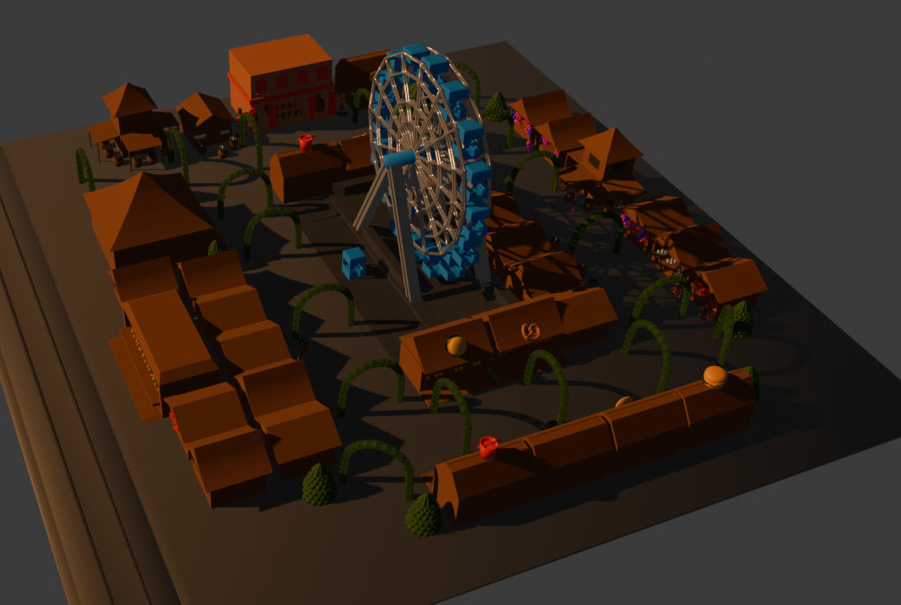

# 🎡 City of Stories - Interactive Winterfest Experience

Een interactieve 3D winterfestival ervaring gebouwd met React, Three.js en React Three Fiber. Verken een betoverend winterlandschap vol met Points of Interest (POIs), maak een ritje in het reuzenrad, en geniet van de winterse sfeer.



## 📋 Inhoudsopgave

- [Over het Project](#over-het-project)
- [Features](#features)
- [Technologie Stack](#technologie-stack)
- [Installatie](#installatie)
- [Gebruikte Sounds](#gebruikte-sounds)
- [Hoe het Werkt](#hoe-het-werkt)
- [Project Structuur](#project-structuur)
- [Gebruikshandleiding](#gebruikshandleiding)

## 🎯 Over het Project

City of Stories is een immersieve 3D webapplicatie die bezoekers meeneemt in een virtuele winterfestival omgeving. Het project combineert 3D graphics, animaties en geluid om een meeslepende ervaring te creëren waarbij gebruikers verschillende locaties kunnen verkennen, zoals een Cecemel Cabin, Luna Park, en een iconisch reuzenrad.

**Gemaakt door:** Segers Keano

## ✨ Features

- **🎪 Interactieve 3D Omgeving** - Volledig navigeerbare 3D winterfestival scene
- **📍 Points of Interest (POIs)** - Meerdere interessante locaties om te ontdekken
- **🎠 Reuzenrad Ervaring** - Stap in het reuzenrad en geniet van een ritje met moving camera
- **🎵 Achtergrondmuziek** - Sfeervolle Lo-Fi Beats voor een authentieke wintersfeer
- **🌬️ Dynamische Geluidseffecten** - Windgeluid tijdens het reuzenrad ritje
- **🎮 Twee Camera Modes** - Grab mode (vrije camera) en Viewer mode (POI detectie)
- **🎯 Tour Mode** - Geautomatiseerde tour langs alle POIs
- **🎨 Dark/Light Theme** - Schakel tussen donker en licht thema
- **📱 Responsive Design** - Werkt op verschillende schermformaten
- **⚡ Smooth Animaties** - GSAP-powered camera animaties

## 🛠️ Technologie Stack

- **React 19.2.0** - UI framework
- **Three.js 0.182.0** - 3D graphics library
- **React Three Fiber 9.5.0** - React renderer voor Three.js
- **React Three Drei 10.7.7** - Handige helpers voor R3F
- **GSAP 3.14.2** - Animatie library
- **Vite 7.2.4** - Build tool en dev server
- **ESLint** - Code linting

## 🚀 Installatie

### Vereisten

- Node.js (versie 16 of hoger)
- npm of yarn

### Stappen

1. **Clone de repository**

   ```bash
   git clone https://github.com/SegeKea26/city-of-stories.git
   cd city-of-stories
   ```

2. **Installeer dependencies**

   ```bash
   npm install
   ```

3. **Start de development server**

   ```bash
   npm run dev
   ```

4. **Open je browser**
   - Navigeer naar `http://localhost:5173` (of de poort die Vite aangeeft)

### Andere Commands

```bash
# Build voor productie
npm run build

# Preview productie build
npm run preview

# Lint code
npm run lint
```

## 🔊 Gebruikte Sounds

Het project maakt gebruik van twee audio bestanden die zich bevinden in de `public/sounds/` map:

### 1. **Late-Christmas-Night_Lo-Fi-Beats.mp3**

- **Gebruik:** Achtergrondmuziek voor de hele ervaring
- **Volume:** 10% (0.1)
- **Loop:** Ja, speelt continu
- **Trigger:** Speelt automatisch af bij het laden van de pagina (met fallback naar gebruikersinteractie indien autoplay geblokkeerd wordt)
- **Implementatie:** `useBackgroundMusic.jsx` hook

### 2. **wind-sound.mp3**

- **Gebruik:** Windgeluid tijdens het reuzenrad ritje
- **Volume:** 50% (0.5)
- **Loop:** Ja, tijdens het ritje
- **Trigger:** Start wanneer gebruiker het reuzenrad betreedt, stopt bij verlaten
- **Implementatie:** `useWindSound.jsx` hook

## 🎮 Hoe het Werkt

### Applicatie Flow

1. **Initialisatie**

   - De app start met een loading screen die de 3D modellen laadt
   - Achtergrondmuziek begint te spelen
   - Camera start in default positie met auto-rotate

2. **Camera Modes**

   **Grab Mode (🤚)**

   - Standaard mode
   - Vrije camera rotatie met muis drag
   - Auto-rotate wanneer niet geïnteracteerd wordt
   - Klik op "Start Tour" voor automatische rondleiding

   **Viewer Mode (👁️)**

   - Automatische POI detectie met crosshair
   - Richt de camera naar een POI om deze te selecteren
   - Klik om POI details te bekijken

3. **POI Systeem**

   - Elk Point of Interest heeft een unieke positie, label, beschrijving en afbeeldingen
   - POIs kunnen bezocht worden via:
     - Direct klikken (in Grab mode)
     - Raycasting detectie (in Viewer mode)
     - Tour mode navigatie
   - Camera animeert smooth naar geselecteerde POI

4. **Reuzenrad Feature**

   - Speciale POI genaamd "Wheel Cashier"
   - Klik op "Enter Ferris Wheel" knop
   - Camera volgt bewegend karretje
   - Windgeluid speelt tijdens het ritje
   - Exit via "Exit Wheel" knop

5. **Tour Mode**
   - Geautomatiseerde tour langs alle POIs in voorgedefinieerde volgorde
   - Navigeer met "Previous" en "Next" knoppen
   - Exit tour via "Exit Tour" knop

### Belangrijkste Componenten

**Experience.jsx**

- Hoofdcomponent die de 3D scene orcheert
- Beheert camera states en modi
- Integreert alle hooks en modellen

**Custom Hooks** (`src/hooks/`)

- `useCameraAnimation` - Camera bewegingen en animaties
- `usePOIManager` - State management voor POIs
- `useFerrisWheel` - Reuzenrad logica
- `useBackgroundMusic` - Muziek afspelen
- `useWindSound` - Wind effecten
- En vele andere voor specifieke functionaliteit

**3D Modellen** (`src/models/`)

- `WinterfestWheel.jsx` - Reuzenrad model
- `WinterfestCabin.jsx` - Cabin structuren
- `WinterfestArea.jsx` - Hoofd festival terrein

**POI Data** (`src/data/poiData.js`)

- Configuratie van alle Points of Interest
- Bevat posities, labels, beschrijvingen en afbeeldingen
- Tour volgorde definitie

## 📁 Project Structuur

```
city-of-stories/
├── public/
│   ├── images/          # POI afbeeldingen
│   ├── model/           # 3D model bestanden
│   └── sounds/          # Audio bestanden
├── src/
│   ├── components/      # React componenten (Button, Header, Footer, etc.)
│   ├── data/           # POI data configuratie
│   ├── Experience/     # Hoofd 3D experience component
│   ├── hooks/          # Custom React hooks
│   ├── models/         # 3D model components
│   ├── App.jsx         # Root component
│   └── main.jsx        # Entry point
├── index.html
├── package.json
└── vite.config.js
```

## 🎯 Gebruikshandleiding

1. **Navigeren**

   - Sleep met je muis om de camera te roteren (in Grab mode)
   - Camera roteert automatisch als je niet interacteert

2. **POI Verkennen**

   - Klik op een POI marker in Grab mode
   - Of schakel naar Viewer mode en richt de crosshair op een POI

3. **Reuzenrad**

   - Navigeer naar "Wheel Cashier" POI
   - Klik "Enter Ferris Wheel"
   - Geniet van het ritje met windgeluid
   - Klik "Exit Wheel" om te stoppen

4. **Tour Mode**

   - Klik "Start Tour" in Grab mode
   - Gebruik "Next" en "Previous" om te navigeren
   - Klik "Exit Tour" om terug te keren naar vrije navigatie

5. **Thema Wisselen**
   - Klik op de zon/maan icoon rechtsboven voor dark/light theme

## 📝 Licentie

Dit is een persoonlijk project gemaakt door Segers Keano.

## 🙏 Credits

- 3D Modellen: Custom gemaakt voor dit project
- sketchfab modellen: knuffels, burger, pizza, noodles, pretzels
- Muziek: Late Christmas Night Lo-Fi Beats
- Geluidseffecten: Wind sound effect
- Technologie: React, Three.js, React Three Fiber, GSAP

---

**Veel plezier met het verkennen van de City of Stories! 🎡✨**
